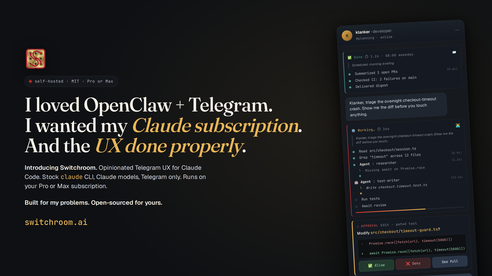

<p align="center">
  
</p>

# Switchroom

[](https://buildkite.com/ken-thompson/switchroom)
[](https://buildkite.com/ken-thompson/switchroom)
[](https://buildkite.com/ken-thompson/switchroom)
[](https://buildkite.com/ken-thompson/switchroom)

**Your Claude Pro or Max, as a fleet of always-on agents in Telegram. Opinionated UX, done properly.**

> *I loved OpenClaw + Telegram. I wanted my Claude subscription. And the UX done properly. So I built this.*

**Compliance-by-design.** Switchroom leverages Claude Code natively — unmodified `claude` CLI, no Agent SDK, no direct API. It sets up the CLI the way you would, then gets out of the way. See the [Compliance Attestation](docs/compliance-attestation.md) for detail.

## Right, so what's this about

So you had the bright idea. Run Claude Code agents 24/7 on a cheap Linux box, talk to them from Telegram, use the Claude Pro or Max subscription you're already paying for. Sensible. Obvious, even.

Then you tried OpenClaw. Followed the docs, spun it up, got it running, only to realise halfway through that you're pinging the Anthropic API on your own key and your token bill is quietly ticking over in the background. Bit of a bait and switch, that one. You signed up for "use your subscription," not "buy API credits on top of your subscription."

So you gave Claude Code's built-in Telegram channel a crack instead. Sent a message. Waited. Something happened, maybe. Eventually a reply came back. What did the agent actually do? No idea. Which tools ran? No idea. Did it get stuck, crash, spawn a sub-agent, read half your repo? No idea. It's an MVP black box of death, and I got sick of squinting into it.

So I built this.

## What Switchroom is, and isn't

Switchroom is an opinionated implementation of a Telegram plugin and agent lifecycle layer, sitting on top of the official `claude` CLI. No fork. No custom runtime in Docker. No API key interception. Your Claude Pro or Max subscription does the work, the same way it does on your desktop, authenticated via the same OAuth flow, fully compliant with Anthropic's terms.

It is not trying to be a general-purpose LLM orchestrator. It doesn't care about OpenAI, Gemini, Llama, or swapping model providers. It is not a multi-channel bridge for Slack, Discord, Teams. It does one thing: makes Telegram the best possible interaction surface for Claude Code. Unashamedly.

The whole thing is built around one idea. Every time an agent starts work, a **progress card** pops into Telegram and stays pinned while the task runs. It updates in place as tools execute, so you see each Read, Bash, Edit, Grep happen as it happens.

```
⚙️ Working… · ⏱ 12s
💬 refactor the auth module to use JWT
  ─ ─ ─
  … (+3 more earlier steps)
  ✅ Read src/auth/session.ts
  ✅ Grep "cookie" (in src/)
  🤖 Edit src/auth/jwt.ts · 4s
```

When the agent finishes, the card flips to Done and unpins. Two agents working at the same time? Each gets its own card, labelled `(1/2)` and `(2/2)`, so you can follow both without losing the plot.

## The UX bits that matter

- Cards update at most once every 5 seconds. Fast enough to follow, not so fast it floods
- Last 5 steps are always visible, older ones collapse into `(+N more earlier steps)`
- Running steps show elapsed time so you can tell if something's stuck
- Sub-agents get their own section in the card, so nested work is visible, not hidden
- No silent gaps. No ghosts.

## Architecture

One Claude Code REPL per agent, dressed up with systemd and a Telegram bot. Two systemd units per agent: the Claude process (`switchroom-<agent>.service`) and its Telegram gateway (`switchroom-<agent>-gateway.service`). See [`docs/architecture.md`](docs/architecture.md) for the process model, IPC layout, and how each layer maps to the `claude` CLI.

```
You (Telegram)
    │
    ▼
@YourBot ──── switchroom-telegram MCP ──── Claude Code CLI
                  │                        │
                  ├─ Progress cards         ├─ .claude/agents/*.md (sub-agents)
                  ├─ Pin / unpin lifecycle  ├─ settings.json (tools, hooks, MCP)
                  ├─ SQLite history         ├─ Hindsight plugin (memory)
                  ├─ Emoji reactions        └─ systemd (agent + cron timers)
                  └─ Format conversion
```

Switchroom is **not a harness**. Each agent runs the unmodified `claude` binary, authenticated directly with Anthropic via official OAuth. No credential interception, no API key routing.

## Everything else you get

| Feature | What it does |
|---------|-------------|
| **Claude Pro/Max auth** | OAuth, not API keys. No per-token billing. |
| **Multi-agent** | Opus plans, Sonnet implements in the background. Sub-agent work surfaces in the card. |
| **Config cascade** | Defaults, then profiles, then per-agent YAML. Change one line, every agent updates. |
| **Scheduled tasks** | Cron-based systemd timers. Survive reboots. |
| **Persistent memory** | Hindsight semantic memory with knowledge graphs. |
| **Session continuity** | Resume sessions across restarts with freshness gating. |
| **Encrypted vault** | AES-256-GCM for secrets. |
| **10 Telegram MCP tools** | Reply, pin, react, history, attachments, stream progress, all of it. |

## How it stacks up against the alternatives

| | Switchroom | Claude Code channels | OpenClaw | NanoClaw |
|---|---|---|---|---|
| Progress visibility | Live progress cards, pinned | None, black box | None | None |
| Runtime | Claude Code CLI | Claude Code CLI | Custom runtime | Agents SDK |
| Auth | Pro/Max OAuth | Pro/Max OAuth | API key | API key |
| Sub-agent tracking | Yes, visible in card | No | No | No |
| Parallel task display | Labelled cards `(1/N)` | No | No | No |
| Config | YAML with cascade | None | JSON/TOML | Env vars |
| Setup | `switchroom setup` | Built-in (limited) | Docker compose | Docker compose |

## Install

Ubuntu 24.04 LTS, 4GB RAM. Linux only.

### One-liner (fresh box)

```bash
curl -fsSL https://get.switchroom.ai | bash
```

Bootstraps bun, node 22, the claude CLI, and switchroom-ai. Idempotent. Safe to re-run. Source is [`install.sh`](install.sh) in this repo.

Then:

```bash
switchroom setup                                        # interactive Telegram wiring
switchroom agent create coach --profile health-coach    # scaffold your first agent
switchroom auth login coach                             # link your Pro or Max session
switchroom agent start coach                            # go
```

After the last command you talk to the agent from Telegram. You don't touch the server again.

### Already have node?

```bash
npm install -g @anthropic-ai/claude-code switchroom-ai
switchroom setup
```

Node 20.11+. `switchroom setup` is the interactive first-time wizard — scaffolds config, handles Telegram wiring, sets up the vault.

### One-shot happy path (no wizard)

If you already have Telegram credentials in `~/.switchroom/switchroom.yaml`, skip `switchroom setup`. `agent create --profile` writes a minimal entry for you, and auth is scoped per-agent:

```bash
switchroom agent create coach --profile health-coach
switchroom auth login coach
switchroom agent start coach
```

## Example Configuration

```yaml
switchroom:
  version: 1

telegram:
  bot_token: "vault:telegram-bot-token"
  forum_chat_id: "-1001234567890"

memory:
  backend: hindsight

defaults:
  model: claude-opus-4-6   # or claude-sonnet-4-6, claude-haiku-4-5
  tools: { allow: [all] }
  subagents:
    worker:
      description: "Implementation tasks"
      model: sonnet
      background: true
      isolation: worktree
  schedule:
    - cron: "0 8 * * 1-5"
      prompt: "Morning briefing"
  session:
    max_idle: 2h

agents:
  assistant:
    topic_name: "General"
    memory: { collection: general }

  coach:
    topic_name: "Coach"
    extends: advisor
    soul:
      name: Coach
```

See [docs/configuration.md](docs/configuration.md) for the full reference.

## Vault broker (cron secrets)

Scheduled tasks run headless via `systemd --user` timers, so they cannot prompt
for the vault passphrase. The vault broker is a long-running user-level systemd
unit that holds the vault decrypted in memory after a one-time interactive
unlock. Cron tasks fetch the specific keys they declare via a unix socket; the
passphrase never sits on disk.

**Declare per-cron secrets in `switchroom.yaml`:**

```yaml
agents:
  scout:
    schedule:
      - cron: "0 8 * * *"
        prompt: "Morning brief."
        secrets: [openai_api_key, polygon_api_key]   # only these may be read
```

`secrets: []` (the default) means the cron has no vault access.

**Bootstrap once per host:**

```bash
switchroom update                       # installs the broker systemd unit
switchroom vault broker unlock          # prompt for passphrase, primes broker
```

Or just run `switchroom vault get <key>` from a TTY — the broker offers to
take the unlocked state with `[Y/n]` so you don't have to remember a separate
unlock command.

**Identity model.** On Linux, the broker reads `/proc/<pid>/cgroup` to find
the connecting cron's systemd unit (`switchroom-<agent>-cron-<i>.service`).
Cgroup membership is set by systemd as root and is unspoofable from
userspace, so a compromised agent cannot pose as another agent's cron and
read its keys. macOS and other platforms degrade to UID-only via the socket
file mode 0600 — fine for desktop use, not recommended for production cron.

The broker locks on `SIGTERM` (so a `restart` zeros the in-memory state)
and on demand via `switchroom vault broker lock`. Use
`switchroom vault get <key> --no-broker` to bypass and prompt locally.

Unit installed at `~/.config/systemd/user/switchroom-vault-broker.service`.

## CLI Reference

```bash
switchroom setup                              # Interactive wizard
switchroom doctor                             # Health check
switchroom update                             # Pull latest + rebuild + reconcile + restart
switchroom restart [agent] [--force]          # Bounce agent(s); drains in-flight turn by default
switchroom version                            # Show versions + running agent health summary

switchroom agent list                         # Status of all agents
switchroom agent create <name> [--profile <p>] # Scaffold + install timers; --profile writes yaml entry
switchroom agent reconcile <name|all>         # Re-apply switchroom.yaml (without pulling/building)
switchroom agent start|stop|restart <name>    # Lifecycle (with preflight)
switchroom agent attach <name>                # Interactive tmux session
switchroom agent logs <name> [-f]             # View logs
switchroom agent grant <name> <tool>          # Grant a tool permission
switchroom agent permissions <name>           # Show allow/deny list
switchroom agent dangerous <name> [off]       # Toggle full tool access
```

Profiles live in `profiles/` at the repo root. Bundled ones for `--profile`: `coding`, `default`, `executive-assistant`, `health-coach` (the `_base/` dir is framework-internal render templates and is not a user-selectable profile).

`switchroom agent create <name> --profile <profile>` does two things in one step:

1. Adds an entry to `switchroom.yaml` under `agents:` with `extends: <profile>` and a derived `topic_name` (capitalized agent name). Edit the yaml afterwards to change the topic name, emoji, tools, etc.
2. Scaffolds the agent directory and installs the systemd unit (same as running `agent create` on an entry that already exists in yaml).

If the agent is already in yaml, `--profile` must match the existing `extends:` value or it errors. If the yaml entry has no `extends:` and you pass `--profile`, the flag is written in additively with a warning. Running `agent create` with no `--profile` on a missing entry keeps the old "Agent not defined in switchroom.yaml" error, now with a hint to use `--profile`.

Model aliases: the bare names `opus`, `sonnet`, `haiku` are accepted alongside the full IDs (`claude-opus-4-6`, `claude-sonnet-4-6`, `claude-haiku-4-5`). Use whichever reads cleaner in your config.

### Authentication (multi-account slot pool)

Each agent has a pool of Claude OAuth slots. The **active** slot is what
the agent uses; other slots are automatic fallbacks when the active slot
hits its quota window. Every `<slot>` option defaults to the active slot
if omitted.

```bash
switchroom auth status                            # All agents, one table
switchroom auth login <agent>                     # First-time OAuth into the active slot
switchroom auth code <agent> <browser-code>       # Paste the code back from the browser
switchroom auth cancel <agent>                    # Abandon a pending login
switchroom auth reauth <agent> [--slot <s>]       # Fresh OAuth, replace existing token
switchroom auth refresh <agent>                   # Alias for reauth (back-compat)

switchroom auth add <agent> [--slot <name>]       # Add another account to the fallback pool
switchroom auth use <agent> <slot>                # Switch the active slot
switchroom auth list <agent> [--json]             # Show slots: health, quota status, expiry
switchroom auth rm <agent> <slot> [--force]       # Remove a slot (refuses active/last slot)
```

The fallback pool also works from Telegram. The switchroom MCP plugin
exposes the same verbs as `/auth add|use|list|rm` inside the chat.

### Workspace (agent bootstrap layer)

Each agent has a workspace directory (`~/.switchroom/agents/<name>/workspace/`)
with editable stable files (`AGENTS.md`, `SOUL.md`, `USER.md`, `IDENTITY.md`,
`TOOLS.md`) and dynamic files (`MEMORY.md`, `memory/YYYY-MM-DD.md`,
`HEARTBEAT.md`) that are injected into the model's context at turn time.

```bash
switchroom workspace path <agent>                 # Print the workspace dir
switchroom workspace show <agent> [file]          # Print one workspace file (default AGENTS.md)
switchroom workspace edit <agent> [file]          # Open in $EDITOR (default AGENTS.md)
switchroom workspace render <agent> --stable      # Dump the stable bootstrap block (for start.sh)
switchroom workspace render <agent> --dynamic     # Dump the dynamic block (for UserPromptSubmit)
switchroom workspace search <agent> <query...>    # BM25-lite search over workspace markdown
switchroom workspace commit <agent> [-m <msg>]    # Git checkpoint of workspace state
switchroom workspace status <agent>               # git status on the workspace
```

### Observability

```bash
switchroom debug turn <agent>                     # Dump the exact prompt layering from the last turn
switchroom memory setup|search|stats|reflect      # Hindsight memory
```

### Other

```bash
switchroom topics sync|list|cleanup               # Telegram forum topics
switchroom vault init|set|get|list|remove         # Encrypted secrets
switchroom handoff <agent>                        # Cross-session handoff summarizer
switchroom web                                    # Web dashboard
```

### Migrating credentials from OpenClaw

`scripts/import-openclaw-credentials.ts` is a one-shot migration script that lifts `/data/openclaw-config/credentials/` into the Switchroom vault. It ships with a small set of default mappings for filenames OpenClaw documents out of the box.

User-specific credential filenames (your custom bot tokens, SSH keys, and so on) belong in a local overlay file — not in the source repository. Create `~/.switchroom/import-openclaw.yaml`:

```yaml
# ~/.switchroom/import-openclaw.yaml
files:
  telegram-bot-token-mybot: telegram/mybot-bot-token
  discord-bot-token-mybot: discord/mybot-bot-token
  my-server-ssh-key: ssh/my-server
skip:
  compass-mac-cookies.json: "auto-managed by compass skill (8h TTL cache)"
secrets_env:
  X_BEARER_TOKEN: x-api/bearer-token
directories:
  garmin-tokens: garmin/tokens
```

Overlay entries win on collision with built-in defaults. Unknown files that appear in neither defaults nor the overlay surface as `warn` entries so nothing is silently dropped. Run `bun scripts/import-openclaw-credentials.ts --help` for flags including `--mapping <path>` to override the default overlay location.

## Documentation

| Guide | Description |
|-------|-------------|
| **[Configuration](docs/configuration.md)** | Full field reference, cascade semantics, profiles |
| **[Telegram Plugin](docs/telegram-plugin.md)** | Progress cards, 10 MCP tools, emoji reactions |
| **[Sub-Agents](docs/sub-agents.md)** | Model routing, delegation patterns, frontmatter spec |
| **[Scheduling](docs/scheduling.md)** | Cron tasks, systemd timers, model selection |
| **[Session Management](docs/session-optimization.md)** | Continuity, compaction, freshness policy |
| **[OpenClaw alternative](docs/vs-openclaw.md)** | Switchroom vs OpenClaw |
| **[NanoClaw alternative](docs/vs-nanoclaw.md)** | Switchroom vs NanoClaw |
| **[Compliance](docs/compliance-attestation.md)** | Anthropic compliance analysis |
| **[Telemetry](docs/posthog.md)** | What Switchroom reports to PostHog and how to opt out |

## Telemetry

Switchroom reports anonymous usage events and errors to PostHog so we can spot regressions and understand which commands are used. **No personal data, code, or message content leaves your machine.** The anonymous ID lives at `~/.switchroom/analytics-id` and is a random UUID. Not tied to your username, email, IP, or machine identifier (we pass `disableGeoip: true` on every event).

To opt out, set this in your shell profile:

```bash
export SWITCHROOM_TELEMETRY_DISABLED=1
```

Full event catalogue, dashboard links, and the source module at [docs/posthog.md](docs/posthog.md).

## FAQ

**Can I use a Claude Pro or Max subscription instead of an API key?**
Yes. That's the whole point. Switchroom runs the unmodified `claude` CLI with the same OAuth flow you use on the desktop app. No API key. No per-token billing.

**How is this different from Claude Code's built-in Telegram channel?**
The built-in channel is message in, message out, with zero visibility into what the agent is doing in between. Switchroom adds live progress cards that pin to the top of each topic and update as tools execute. You can always see what's happening, which is the bit the built-in channel gets wrong.

**Does it work with multiple agents at the same time?**
Yes. Each agent gets its own Telegram forum topic. When multiple agents are working simultaneously, each has its own pinned progress card labelled `(1/N)`, `(2/N)` and so on.

**Can I see what sub-agents are doing?**
Yes. When an agent delegates to a sub-agent (a worker, a researcher), the sub-agent's activity shows up in its own section of the progress card. You see the full hierarchy, not just the top-level agent.

**What does it cost to run?**
A cheap Linux VPS (around $6/mo on Hetzner, DigitalOcean, wherever), plus your existing Claude Pro ($20/mo) or Max ($100/mo) subscription. Switchroom itself is MIT-licensed, free.

**Is this against Anthropic's terms of service?**
No. Switchroom uses the official `claude` binary with the official OAuth flow. See [docs/compliance-attestation.md](docs/compliance-attestation.md) for the full analysis.

**Is Switchroom an alternative to OpenClaw?**
Yes. Same use case, but it uses your Claude subscription via OAuth instead of an API key, and runs the native `claude` binary instead of a custom runtime in Docker. See [vs-openclaw](docs/vs-openclaw.md).

## License

MIT. See [CONTRIBUTING.md](CONTRIBUTING.md).
