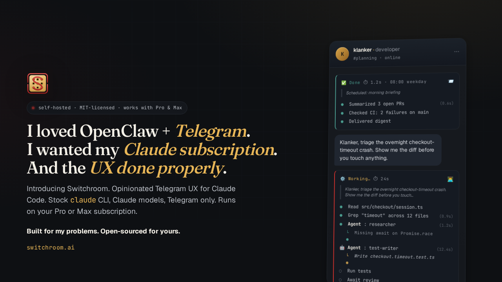
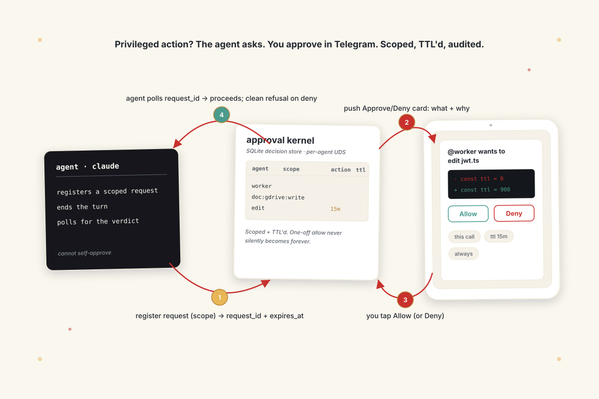

<p align="center">
  
</p>

# Switchroom

[](https://github.com/switchroom/switchroom/actions/workflows/ci-tests-core.yml)
[](https://github.com/switchroom/switchroom/actions/workflows/ci-tests-plugin.yml)
[](https://github.com/switchroom/switchroom/actions/workflows/docker-e2e.yml)
[](https://github.com/switchroom/switchroom/actions/workflows/ci-evals.yml)
[](https://github.com/switchroom/switchroom/actions/workflows/ci-evals.yml)

**A switchboard for your Pro or Max.** Your standing team. Specialist assistants who remember you, own their patch, and act, while you get on with life. You text them from Telegram. They run on the Claude subscription you already pay for.

[Latest release notes →](CHANGELOG.md)

## Why this exists

> *I loved OpenClaw + Telegram. I wanted my Claude subscription. And the UX done properly. So I built this.*

The use case came from OpenClaw: always-on assistants in a chat app, each with a personality and a job. Good idea. Three things stopped it being the one I needed, and nothing else fixed them:

- **On the subscription, properly.** The Claude plan I already pay for, the same OAuth as the desktop. Compliant. Predictable cost. Not an API meter. Not a second invoice.
- **On the leash.** Give an assistant broad standing access and one day it helpfully does something irreversible. Credentials, tools, skills: granted deliberately, approved by a human, no way around it.
- **Telegram, done properly.** Not a bridge spread thin across Slack, Discord, Teams. One channel. Opinionated. Excellent.

So I built it.

## See it work

You text a specialist the way you'd text a good assistant. Here is `clerk`, a chief of staff that runs the calendar, watches the health data, and fields the household asks, all in one voice, because it knows you across all of it.

> **You:** move my 3pm to Thursday and tell Sarah why

clerk knows your week and knows who Sarah is. It gets on with it, then tells you in plain words what it did. No tool-call log to babysit.

```
clerk
Thursday 3 to 4pm is clear. Moved "Design review" there.

Drafted a note to Sarah:
  "Had to shift our 3pm to Thursday. Same agenda,
   see you then."

Send it?                          [ Send ]   [ Edit ]
```

It does the work itself. It stops at the one thing that matters, the message leaving your hands, and waits for your tap. Nothing with consequences happens on the agent's say-so alone. You are never left wondering what it is doing, and you never have to watch it. [Full UX behaviour →](docs/telegram-plugin.md)

## Quickstart

Runs on the box you already have. Supported production runtime is Linux + Docker. Canonical target: Ubuntu 24.04 LTS, 4 GiB RAM minimum, 8 GiB once you run more than one agent. macOS (Docker Desktop) works for development, not yet release-validated.

**Fresh Linux box, one script:**

```bash
curl -fsSL https://github.com/switchroom/switchroom/raw/main/scripts/install-deps.sh | sudo bash
```

Installs Docker Engine + Compose v2, Node.js 20.11+, Bun, and the `@anthropic-ai/claude-code` + `switchroom` CLIs. Idempotent. Log out and back in so the docker group takes effect, then:

```bash
switchroom setup                       # interactive: Telegram + vault + first agent
switchroom apply                       # generate ~/.switchroom/compose/docker-compose.yml
docker compose -p switchroom -f ~/.switchroom/compose/docker-compose.yml up -d
switchroom auth add default --via-claude   # OAuth your Pro/Max account, AFTER the fleet is up
switchroom auth use default                # make it the fleet-wide active account
```

Auth comes after the fleet is up on purpose. The `switchroom-auth-broker` is the sole writer of credentials and does not exist until the compose stack is running. After this you talk to the agent from Telegram and never touch the server again. To catch a running host up later use `switchroom update`, not a raw `docker compose up` (a bare compose-up on a live fleet skips the operator restart-marker, so boot cards render as crashes).

**Already in Claude Code?** Shortest path. Inside any session:

```
/plugin marketplace add switchroom/switchroom
/plugin install switchroom@switchroom
/switchroom:setup
```

Full new-user walkthrough, zero to first Telegram message in ~15 minutes, plus the npm-only path, the no-wizard one-shot, the BotFather steps, and static-binary status: **[docs/install.md](docs/install.md)**.

## What you get

| Feature | What it does |
|---|---|
| **A standing team** | One bot per specialist, each with its own persona, memory, skills, tools, and credentials. Add a specialist in ten lines of YAML. You don't fork the product. |
| **You hold the leash** | Per-agent least-privilege ACL over an AES-256-GCM vault. Anything extra needs your tap on an inline Telegram Approve/Deny card. No heartbeats: beck-and-call plus the schedules you set, never roaming. |
| **Persistent memory** | Hindsight semantic memory, including a per-user mental model that carries across conversations and restarts. |
| **Claude Pro/Max auth** | OAuth, not API keys. No per-token billing. Fleet-wide active account plus fallback order, broker-owned refresh and credential fanout. |
| **Always available** | Long-running service per agent. Survives reboots, network drops, your laptop closing. Resumes mid-turn with a wake-audit. |
| **Honest status** | Every topic shows plain-language state: quiet, working, or idle. Never a black box, never silent, never a tool-call log to babysit. |
| **Live progress, whole replies** | A live progress surface shows what the agent is doing while it works, with a Steer button to redirect mid-turn. The reply itself lands as a whole message when the work is done (long replies chunked), posted in the topic, not pinned, no stale cards. |
| **Sub-agents** | Opus plans, Sonnet implements. Delegated work surfaces as live rows in a shared fleet block. |
| **Config cascade** | Defaults, then profiles, then per-agent YAML. Change one line, every agent updates. |
| **Scheduled tasks** | Cron-syntax tasks that fire across reboots. Headless secret access through the vault broker. |
| **17 Telegram MCP tools** | reply, stream, react, edit, pin, delete, forward, typing, history, checklists (+update), stickers, GIFs, attachment download, ask-user, vault request access/save. |

## Subscription-honest, and safe by default

**Stock CLI, real OAuth.** Each agent runs the unmodified `claude` binary, authenticated with Anthropic through the same OAuth flow you use on the desktop app. No API key. No Agent SDK. No harness. No patched CLI. No proxied inference. This is a hard constraint, not a preference: running the native CLI on the subscription is what keeps switchroom inside Anthropic's third-party policy. One bill, the one you already pay. See the [Compliance Attestation](docs/compliance-attestation.md) for the full analysis.

**Least privilege, and you hold the keys.** This is the core opinion. An agent never holds the vault passphrase and never sees a secret it was not given. Secrets live in an AES-256-GCM vault. Each agent reaches the vault broker over its own socket whose identity is the bind path, so a compromised agent cannot pose as another. An agent can read a key only if you listed it for that agent's task: that is the standing, least-privilege ACL. Anything beyond that is just-in-time. The agent asks, you get an inline Telegram Approve/Deny card showing exactly what and why, and only your tap mints a scoped, expiring grant. The agent cannot self-elevate.

<p align="center"></p>

**The approval kernel gates risky actions too.** A separate kernel daemon handles action approvals on the same model: an agent that wants to write to a Google Doc requests it, ends its turn, and waits. You see the diff and tap Allow or Deny. Nothing destructive happens on the agent's say-so alone. TTL'd decisions expire, and every grant and denial is logged.

### How agents collaborate on files

Switchroom's position: agents should collaborate with you on real documents, not paste walls of text into chat. The supported path is Google Drive. An agent reads and proposes changes, and every write or suggestion is gated through the approval kernel exactly like a credential request, so an agent never silently edits your Drive. Today Drive is opt-in per agent: you connect a Google account and enable it for the agents that should have it (`switchroom drive connect <agent>`), and the broker enforces that allowlist at runtime. It is not on by default for a fresh agent.

## Survives real life

Always available is not enough on its own. Things still die. The product has to handle that or the illusion breaks.

<p align="center"></p>

- **Auto-restart.** Agent containers run with `restart: unless-stopped` and only start once the auth-broker's healthcheck passes. The vault broker, approval kernel, and auth broker each have their own healthchecks, so a wedged dependency is caught instead of silently breaking agents.
- **Resume protocol.** When an agent reboots mid-turn it boots with `SWITCHROOM_PENDING_TURN` plus the original chat ids. Its first action is to acknowledge the gap and ask how to proceed: start over, summarise and continue, or drop it.
- **Wake-audit.** On every fresh boot the agent checks for owed replies, orphan sub-agents, and stale todos. Clean means it stays quiet. If it owed you a reply, it tells you.
- **Token refresh.** The `switchroom-auth-broker` owns the refresh loop and is the sole writer of every `credentials.json`. Per-account quota state fans out across the fleet in seconds, and `auth.fallback_order` cycles when an account is exhausted.

## How it stacks up

| | Switchroom | Claude Code channels | OpenClaw | NanoClaw |
|---|---|---|---|---|
| Runtime | Stock Claude Code CLI | Claude Code CLI | Custom runtime | Agents SDK |
| Auth | Pro/Max OAuth | Pro/Max OAuth | API key | API key |
| Standing access | Per-agent least-privilege ACL | None | Broad/permissive | Broad/permissive |
| Approval UX | Inline Telegram cards | None | None | None |
| Specialist fleet | One bot per specialist, own persona | Single | Yes | Yes |
| Sub-agent tracking | Yes, live fleet block | No | No | No |
| Progress visibility | Deterministic status, never silent | Black box | None | None |
| Config | YAML with cascade | None | JSON/TOML | Env vars |
| Setup | `switchroom setup` | Built-in (limited) | Docker compose | Docker compose |

The wedge against OpenClaw and NanoClaw is not the substrate. It is the stock `claude` CLI under your subscription, on your leash, instead of a custom runtime under your API key with broad standing access. [vs OpenClaw](docs/vs-openclaw.md) and [vs NanoClaw](docs/vs-nanoclaw.md).

## Architecture

One long-running service per agent. Each agent runs the stock `claude` CLI, not a fork, not the Agents SDK, not a wrapped harness, authenticated directly with Anthropic over official OAuth. Switchroom is scaffolding and lifecycle around the CLI you would run by hand: a Telegram bot, an approval kernel, a vault broker, an auth broker, and Docker Compose for supervision.

```
You (Telegram)
    │
    ▼
@YourBot ──┬── switchroom-telegram MCP ──┬── agent supervisor ─── Claude Code CLI
           │       (17 tools)            │     (per-agent)        │
           │                             │                        ├─ .claude/agents/*.md (sub-agents)
           ├─ Deterministic status       ├─ Approval kernel ◄─────┤   settings.json (tools, hooks, MCP)
           │   (quiet/working/idle)      │   (action grants)      ├─ Hindsight plugin (memory)
           ├─ Live progress surface      ├─ Vault broker ◄────────┤   Drive MCP, Playwright MCP, …
           ├─ Sub-agent fleet block      │   (per-agent ACL)      ├─ in-agent scheduler sidecar
           ├─ SQLite history             ├─ Auth broker ◄─────────┤   (cron, fires across reboots)
           └─ Emoji reactions            │   (OAuth refresh,       │
                                         │    sole creds writer)   │
                                         ├─ hostd (host-control:   │
                                         │   /restart, /update)    │
                                         └─ Docker Compose restart (unless-stopped)
```

See [`docs/architecture.md`](docs/architecture.md) for the process model, IPC layout, supervisor choice, and how each layer maps to the `claude` CLI.

## Documentation

| Guide | Description |
|---|---|
| **[Install](docs/install.md)** | Zero-to-first-message new-user walkthrough |
| **[BotFather walkthrough](docs/botfather-walkthrough.md)** | Step-by-step bot creation in Telegram |
| **[Configuration](docs/configuration.md)** | Full field reference, cascade semantics, profiles, example config |
| **[CLI reference](docs/cli-reference.md)** | Every verb, grouped, with behaviour and usage |
| **[Vault](docs/vault.md)** | Architecture, per-cron secrets, ACL, audit log, threat model |
| **[Telegram Plugin](docs/telegram-plugin.md)** | Deterministic UX, 17 MCP tools, checklists, sticker aliases, voice-in |
| **[Sub-Agents](docs/sub-agents.md)** | Model routing, delegation patterns, frontmatter spec |
| **[Scheduling](docs/scheduling.md)** | Cron tasks (in-agent scheduler sidecar), model selection |
| **[Session Management](docs/session-optimization.md)** | Continuity, compaction, freshness policy |
| **[Compliance](docs/compliance-attestation.md)** | Anthropic compliance analysis |
| **[Changelog](CHANGELOG.md)** | Release notes, every version |
| **[Telemetry](docs/posthog.md)** | What Switchroom reports to PostHog and how to opt out |

## FAQ

**Can I use a Claude Pro or Max subscription instead of an API key?**
Yes. That is the whole point. Switchroom runs the unmodified `claude` CLI with the same OAuth flow you use on the desktop app. No API key. No per-token billing.

**What is the leash, exactly?**
An agent only ever uses the credentials and tools you granted it. It can ask for more, and you get an inline Telegram Approve/Deny card showing what and why. Only your tap grants it, the grant is scoped and expiring, and the agent cannot self-elevate or route around you. There are no heartbeats: agents are beck-and-call plus the schedules you set, never roaming on their own.

**Does it work with multiple agents at the same time?**
Yes. Each specialist gets its own Telegram forum topic, its own persona, memory, and tools. When an agent delegates, its sub-agents show up as live rows in a shared fleet block (up to 5, then `+N more`), each with role and current tool.

**What does it cost to run?**
A cheap Linux VPS (around $6/mo on Hetzner, DigitalOcean, wherever), plus your existing Claude Pro ($20/mo) or Max ($100/mo) subscription. Switchroom itself is MIT-licensed, free.

**Is this against Anthropic's terms of service?**
No. Switchroom uses the official `claude` binary with the official OAuth flow, and only ever the interactive CLI on the subscription. See [docs/compliance-attestation.md](docs/compliance-attestation.md) for the full analysis.

## Telemetry

Switchroom reports anonymous usage events and errors to PostHog so I can spot regressions and see which commands are used. **No personal data, code, or message content leaves your machine.** The anonymous ID at `~/.switchroom/analytics-id` is a random UUID, not tied to your username, email, IP, or machine identifier. Opt out with `export SWITCHROOM_TELEMETRY_DISABLED=1`. Full event catalogue at [docs/posthog.md](docs/posthog.md).

## License

MIT. See [CONTRIBUTING.md](CONTRIBUTING.md).
